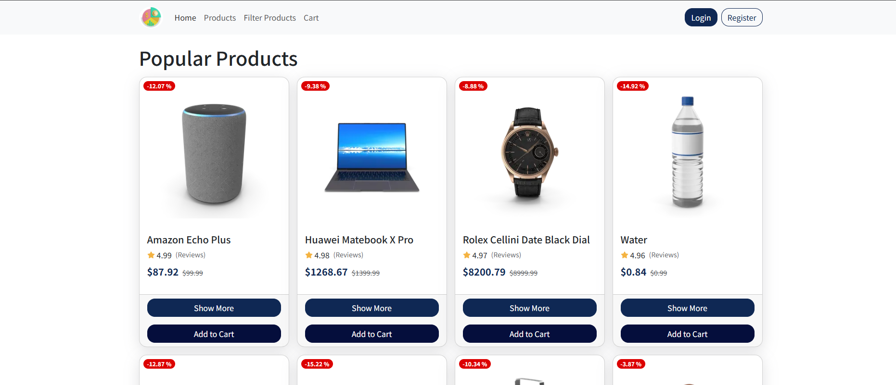

# E-Commerce

## Overview

This is my way of creating an ecommerce online shopping WebApplication getting its Products and users from DummyJson.

For more info on DUmmyJson Visite Web Site:

https://dummyjson.com/

Note:
This is just a front end so you can add to cart but there is not backend processing

## Authentication

For login you can use the DummyJson userNameand password

UserName:emilys
Password:emilyspass

---
